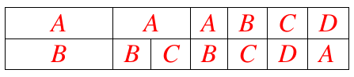

# Задание №10 без программной реализации
## Оптимальное расписание для исполнителей с разной производительностью.
Для выполнения задания необходимо по условиям, указанным для команды в файле 
tasks.md:
1. Рассчитать продолжительность оптимального расписания.
2. Поэтапно заполнить диаграмму Ганта для оптимального расписания, на каждом 
этапе определив приоритеты заданий, назначив исполнителей на задачи и 
определив продолжительность этапа.
3. В итоговом ответе представить диаграмму Ганта с метками времени и оптимальную продолжительность
расписания.
## Примечания
1. Решение оформить в файле с разметкой Markdown, файл назвать 
team_name_solution.md, указав вместо team_name название команды.
2. Файл с решением добавить в отдельную ветку, созаднную на основе данной, 
с названием team_name_manual_task_10, указав вместо team_name название команды.
3. Создать запрос на сляние ветки с решением с данной веткой manual_task_10.
4. Пример добавления изображения с разметкой Markdown, файл с изображением располагается 
в каталоге images

