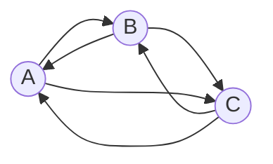

# Задание №7  
## Задачи на взаимную рекурсию 
1. В файле main.py реализовать функцию *get_triangle_path_count*, принимающую   
длину маршрута и возвращающую количество маршрутов заданной дины между тремя 
вершинами.
2. В файле main.py реализовать функцию *generate_strings*, принимающую   
длину строки и возвращающую список строк заданной длины, состоящих из нулей и 
единиц, в которых нули не соседствуют друг с другом.
## Примечания
- Для реализации указанных функций использовать **взаимную рекурсию**.
- Обратить внимание, что некоторые тесты ожидают вызов определенного вида   
исключения с заданным сообщением об ошибке.  
- Разработку вести в отдельной ветке, созданной на основе данной. В названии   
ветки префикс main заменить на название команды.  
- Изменения в ветке должны быть только в файле main.py, различные   
конфигурационные файлы и кэш IDE фиксировать не нужно.  
- Корректность работы функции *get_triangle_path_count* проверить запустив файл   
test_triangle_path.py с модульными тестами.  
- Корректность работы функции *generate_strings* проверить запустив файл   
test_zero_one_strings.py с модульными тестами. 

## Маршруты в треугольнике

Путешественник перемещается между тремя городами A, B и C по трем дорогам и 
каждый день переходит из одного города в другой. Сколько различных замкнутых 
маршрутов, начинающихся и заканчивающихся в городе A может проделать 
путешественник за *n* дней.

Пример расчета количества маршрутов.

| *n* | Маршруты                   | Количество |
|-----|----------------------------|------------|
| 1   | нет                        | 0          |
| 2   | (A->B->A), (A->C->A)       | 2          |
| 3   | (A->B->C->A), (A->C->B->A) | 2          |

Можно обозначить
* an - количество маршрутов длины *n* начинающихся и заканчивающихся 
в A,
* bn - количество маршрутов длины *n* начинающихся в A и 
заканчивающихся в B,
* cn - количество маршрутов длины *n* начинающихся в A и 
заканчивающихся в C.

Тогда справедливы равенства:

$$
\begin{cases}
a_n = b_{n-1} + c_{n-1}
\\
b_n = a_{n-1} + c_{n-1}
\\
c_n = a_{n-1} + b_{n-1}
\end{cases}
$$

С учетом полученных начальных значений *a*, *b* и *c*
* a1 = 0, b1 = 1, c1 = 1
* a2 = 2, b2 = 1, c2 = 1

можно реализовать рекуривные взаимные функции *a(n), b(n), c(n)*.