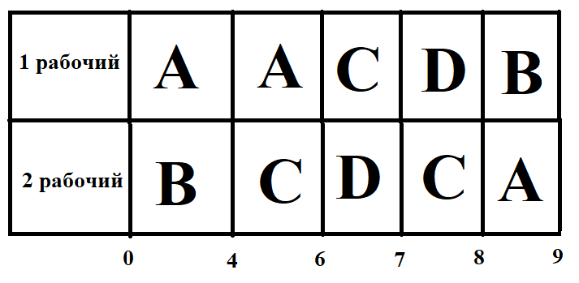

# Решение задачи от Black Team

| Исполнитель        | Ⅰ   | Ⅱ  |
|--------------------|-----|----|
| Производительность | 7   | 3  |

| Задание    | A   | B   | C   | D   |  
|------------|-----|-----|-----|-----|
|Длительность| 45  | 19  | 16  | 10  |

Находим общую длительность работ: T =(45+19+16+10)/(7+3) = 90 / 10 = 9 часов - минимальное время

Назначаем на работу с большей длительностью (A) первого исполнителя (его производительность больше), а на вторую (B) - второго.

A = B? : 45 - 7t = 19 - 3t ⇒ t = 6.5  
A = C? : 45 - 7t = 16 ⇒ t = 4.14  
B = C? : 19 - 3t = 16 ⇒ $\underline {t=1}$

Из полученных t выбираем наименьшую - 1. Вычитаем из работ A и B производительности работников, умноженные на t = 1:

A = 45 - 7 * 1 = 38

B = 19 - 3 * 1 = 16

Обновляем таблицу с длительностями работ: 

| A   | B   | C   | D   |  
|-----|-----|-----|-----|  
| 38  | 16  | 16  | 10  |  

Длительности работ B и C равны ⇒ нужно их объединить в один проект, разделив производительность второго исполнителя на 2.

| A   | B'  | D   |
|-----|----|-----|
| 38  | 16 | 10  |  

Назначаем на работу с большей длительностью (A) первого исполнителя (его производительность больше), а на вторую (B') - второго.

A = B'? : 38 - 7t = 16 - 1.5t ⇒ t = 4

A = D? : 38 - 7t = 10 ⇒ t = 4

B' = D? : 16 - 1.5t = 10 ⇒ t = 4

Из полученных t выбираем наименьшую - 4. Вычитаем из работ A, B и C производительности работников, умноженные на t = 4:

A = 38 - 7 * 4 = 10

B = 16 - 1.5 * 4 = 10

C = 16 - 1.5 * 4 = 10

Обновляем таблицу с длительностями работ:

| A   | B   | C   | D   |  
|-----|-----|-----|-----|  
| 10  | 10  | 10  | 10  |  

ДДлительности работ A, B, C и D равны, значит требуется по $\frac{10+10+10+10}{7+3} = 4$ ед. времени.     

Итоговое t = 1 + 4 + 4 = 9 единиц времени  
**Ответ: 9 ед. времени** 

Строим диаграмму Ганта:

