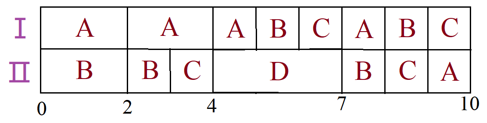



# Решение задачи от Blue team

| Исполнитель        | Ⅰ  | Ⅱ  |
|--------------------|----|----|
| Производительность | 4  | 3  |

| Задание    | A  | B  | C  | D  |  
|------------|----|----|----|----|
|Длительность| 27 | 20 | 14 | 9  |

Работа A -  Ⅰ исполнитель   
Работа B - Ⅱ исполнитель    
$1) A=B? → 27-4t = 20 - 3t ⇒ t = 7$     
$2) A=C? → 27-4t = 14 ⇒ t = 3\frac14$       
$3) B=C? → 20-3t = 14 ⇒ \underline {t=2}$   
***Выбираем третий вариант***   
Обновляем таблицу текущего состояния после t = 2: 

| A  | B  | C  | D  |
|----|----|----|----|
| 19 | 14 | 14 | 9  |       
Работа A -  Ⅰ исполнитель       
Работа B' (B и C) - Ⅱ исполнитель с U = 1,5     
$1) A=B'? → 19-4t = 14 - 1,5t ⇒ \underline {t=2}$       
$2) A=D? → 19-4t = 9 ⇒ t = 2,5$     
$3) B'=D? → 14-1,5t = 9 ⇒ t=3\frac 13$      
***Выбираем первый вариант***       
Обновляем таблицу текущего состояния после последнего t = 2:        

| A  | B  | C  | D  |
|----|----|----|----|
| 11 | 11 | 11 | 9  |
Работа C' (A и B и C) -  Ⅰ исполнитель с U = $\frac43$      
Работа D - Ⅱ исполнитель       
$1) C'=D? → 11-\frac43t = 9 - 3t ⇒ t=-\frac65$      
$2) C'=0? → 11-\frac43t = 0 ⇒ t = 8,25$     
$2) D=0? → 9-3t = 0 ⇒ \underline{t = 3}$        
***Выбираем третий вариант***       
Обновляем таблицу текущего состояния после последнего t = 3:        

| A  | B  | C  | D  |
|----|----|----|----|
|  7 |  7 |  7 |  0 |
Т.к V работ равны (A = B = C) необходимо $\frac{7+7+7}{4+3}=3$ ед. времени до конца.        
Итоговое t = 2+2+3+3 = 10 единиц        
**Ответ: 10 ед. времени**       
Строим диаграмму Ганта:
