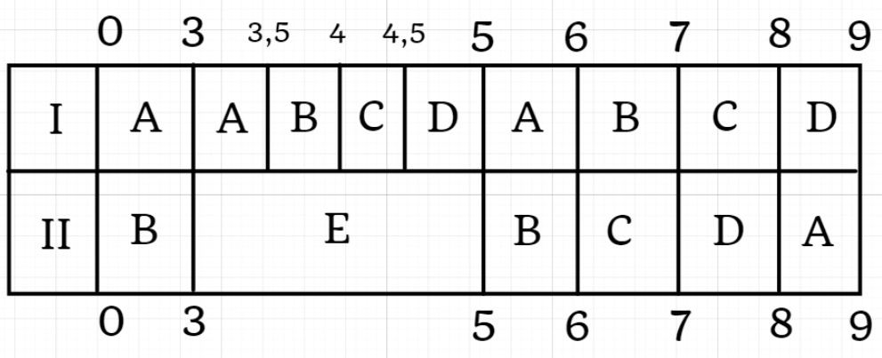

# Исходные данные
| Задание | A | B | C | D | E |
|-----------|---|---|---|---|---|
|Длительность| 21 | 18 | 9 | 9 | 6

| Исполнитель | #1 | #2 |
|--------------------|----|----|
| Производительность | 4 | 3 |
# 1 этап
Исполнитель $$P_1 = 4$$ выполняет наибольшую задачу $$A = 21$$, исполнитель $$P_2 = 3$$, выполняет вторую по величине задачу $$B=18$$.
Составим уравнения равенства двух задач:
$$1) 21 - 4t = 18 - 3t$$ || $$t=3$$
$$2) 21 - 4t = 9$$       || $$t=3$$
$$3) 18 - 3t = 9$$ || $$t=3$$
Выбираем минимальное значение $$t$$, в данном случае они совпали, $$t=3$$.

Занесем результаты этапа в диаграмму Ганта.
# 2 этап
| Задание | A | B | C | D | E |
|-----------|---|---|---|---|---|
|Длительность| 9 | 9 | 9 | 9 | 6

| Исполнитель | #1 | #2 |
|--------------------|----|----|
| Производительность | 4 | 3 |

Исполнитель $$P_1 = 4$$ выполняет наибольшую задачу $$A,B,C,D = 9$$, соответственно $$P_{ABCD} = P_1/4 = 1$$.
Исполнитель $$P_2 = 3$$, выполняет вторую по величине задачу $$E=6$$.
Составим уравнения равенства двух задач:
$$1) 9 - t = 6 - 3t$$ || $$t<0$$ - невозможно
$$2) 9 - t = 0$$       || $$t=9$$
$$3) 6 - 3t = 0$$ || $$t=2$$
Выбираем минимальное значение $$t$$, в данном случае $$t=2$$.

Занесем результаты этапа в диаграмму Ганта.
# 3 этап
| Задание | A | B | C | D | E |
|-----------|---|---|---|---|---|
|Длительность| 7 | 7 | 7 | 7 | 0

| Исполнитель | #1 | #2 |
|--------------------|----|----|
| Производительность | 4 | 3 |

Все оставшиеся объемы равны, можем выполнять их поочередно I и II исполнителем, тогда первый будет выполнять по порядку задачи $$A,B,C,D$$ , а второй задачи $$B,C,D,A$$.
Эти задачи выполнятся за время, равное $$\frac{(A+B+C+D)}{(P_1 + P_2)} =  28/7 = 4$$

Занесем результаты этапа в диаграмму Ганта.
# Диаграмма Ганта
