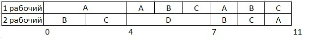

# Решение задачи для Pink Team  
  
| Задание    | A  | B  | C  | D  |
|------------|----|----|----|----|
|Длительность| 28 | 16 | 16 | 6  |

| Исполнитель        | 1  | 2  |
|--------------------|----|----|
| Производительность | 4  | 2  |
  
### A = B,C   
Работа A (I исполнитель):  
t = 4  
Работа B,С (II исполнитель):  

$$p_2' = \frac{2}{2} = 1$$ 

$$28 - 4t = 16 - t$$ 

$$t = 4$$ 

**Подстваляем (t = 4):**  
A: 28 - 4 * 4 = 12  
B,C: 16 - 4 = 12  

Получаем таблицу при t = 4:   

| A | B | C | D |  
|----|----|----|----|  
| 12 | 12 | 12 | 6 |  

### A,B,C = D  
Работа A,B,C (I исполнитель):  

$$t = \frac{4}{3}$$

Работа D (II исполнитель):  

$$t = 2$$ 

$$12 - \frac{4}{3}t = 6 - 2t$$ 
$$t = 3$$ 

**Подстваляем (t = 3):**  
A,B,C: 12 - $\frac{4}{3}$ * 3 = 8  
D: 6 - 2 * 3 = 0  

Получаем таблицу при t = 3:

| A | B | C | D |
|----|----|----|----|
| 8 | 8 | 8 | 0 |

### Вывод:

Т.к. V работ равны (A = B = C) необходимо $\frac{8+8+8}{4+2}=4$ ед. времени до конца.        
Итоговое t = 4+3+4 = 11 единиц        
**Ответ: 11 ед. времени**       

Строим диаграмму Ганта:

