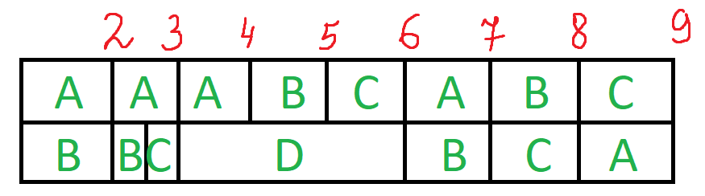

# Решение задачи для red team  
  
| Задание    | A   | B  | C   | D   |  
|------------|-----|----|-----|-----|  
|Длительность| 34  | 26 | 18  | 12  |  
  
| Исполнитель        | 1   | 2   |  
|--------------------|-----|-----|  
| Производительность | 6   | 4   |  
  
Находим общую длительность работ: T =$\frac{34+26+18+12}{6+4}=$$\frac{90}{10}$=$9$
Назначаем на работу с большей длительностью (A) первого исполнителя (его производительность больше), а на вторую (B) - второго.

A = B? : 34 - 6t = 26 - 4t ⇒ t = 4
A = C? : 34 - 6t = 18 ⇒ t = $2\frac23$
B = C? : 26 - 4t = 18 ⇒ $\underline {t=2}$

Из полученных t выбираем наименьшую - 2. Вычитаем из работ A и B производительности работников, умноженные на t = 2:

A = 34 - 6 * 2 = 22 

B = 26 - 4 * 2 = 18

Обновляем таблицу с длительностями работ:

| A  | B  | C  | D  |  
|----|----|----|----|  
| 22 | 18 | 18 | 12 |  

Длительности работ B и C  равны ⇒ нужно их объединить в один проект, разделив производительность второго исполнителя на 2.

| A  | B'  | D |
|----|----|----|
| 22 | 18 | 12 |

Назначаем на работу с большей длительностью (A) первого исполнителя (его производительность больше), а на вторую (B') - второго.

A = B'? : 22 - 6t = 18 - 2t ⇒ $\underline {t = 1}$

A = D? : 22 - 6t = 12 ⇒ t = $1\frac23$

B' = D? : 18 - 2t = 12 ⇒ t = 3

Из полученных t выбираем наименьшую - 1. Вычитаем из работ A, B и C производительности работников, умноженные на t = 1:

A = 22 - 6 * 1 = 16

B = 18 - 2 * 1 = 16

C = 18 - 2 * 1 = 16

Обновляем таблицу с длительностями работ:

| A  | B  | C  | D  |  
|----|----|----|----|  
| 16 | 16 | 16 | 12 |  

Длительности работ A, B и C  равны ⇒ нужно их объединить в один проект, разделив производительность первого исполнителя на 3.

| A'  | D |
|----|----|
| 16 | 12 |

Назначаем на работу с большей длительностью (A') первого исполнителя (его производительность больше), а на вторую (D) - второго.

A' = D? : 16 - 2t = 12 - 4t ⇒ $t < 0$ ⇒ 12 - 4t = 0 ⇒ $\underline {t = 3}$

Работа D была закончена. Вычитаем из работ A, B и C производительности работников, умноженные на t = 3: 

A = 16 - 2 * 3 = 10

B = 16 - 2 * 3 = 10

C = 16 - 2 * 3 = 10

Обновляем таблицу с длительностями работ:

| A  | B  | C  | D  |  
|----|----|----|----|  
| 10 | 10 | 10 | 0 |  

Длительности работ A, B и C равны, значит требуется по $\frac{10+10+10}{6+4}=3$ ед. времени.     

Строим диаграмму Ганта:

***Ответ: 9 ед. времени; см. диаграмму Ганта***